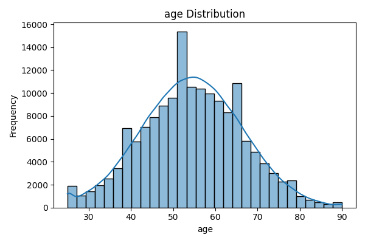
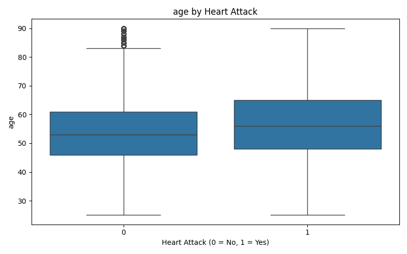
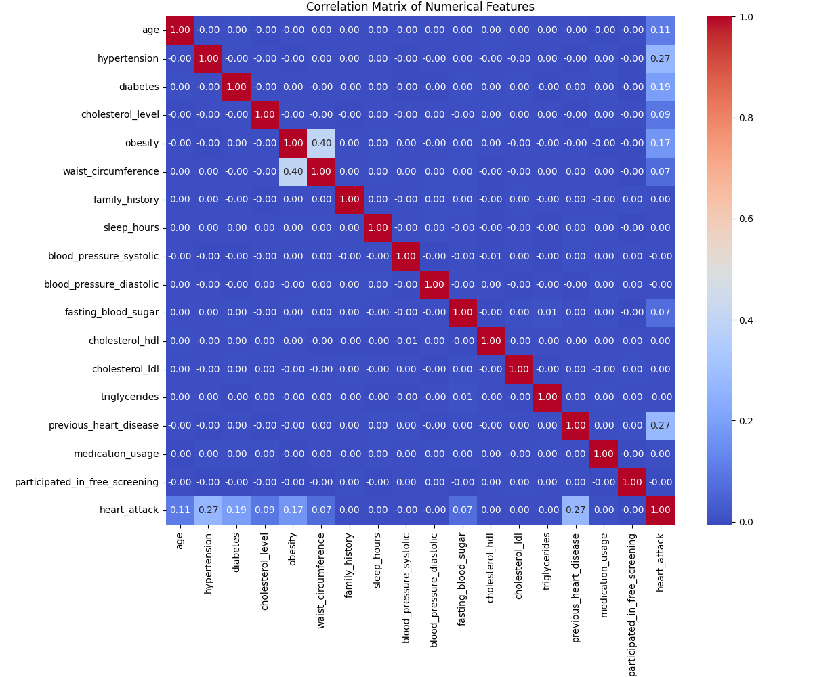
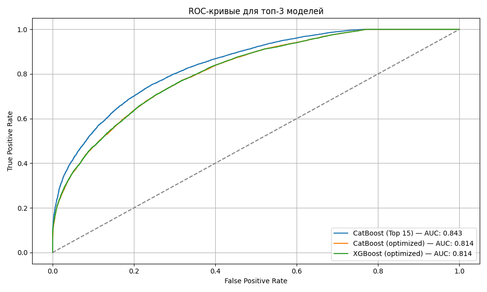
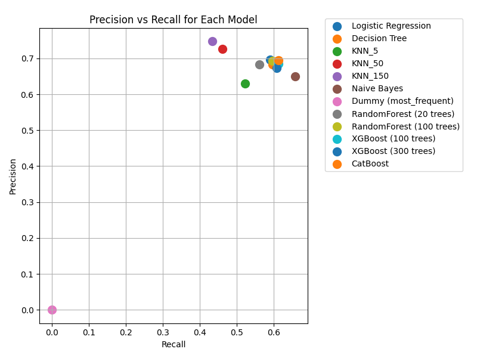

# Infarct Prediction 

    

*An end-to-end machine learning pipeline for predicting heart attacks (myocardial infarction) using patient data — featuring extensive EDA, feature engineering, multiple models (CatBoost, XGBoost, etc.), and comprehensive evaluation.*

## Project Overview 

**Infarct_Prediction** is a data science project focused on predicting the occurrence of heart attacks using machine learning. The repository contains a complete pipeline from data exploration and preprocessing to model training and evaluation. We explore a rich dataset of patient health records, apply feature selection techniques, and train various ML models (including **CatBoost**, **XGBoost**, **Logistic Regression**, and more) to identify those most effective at predicting myocardial infarction (heart attack). The goal is not only to achieve high accuracy, but also to understand key risk factors and ensure the model is interpretable for potential healthcare use.

Key features of this project include:  
- 📊 **Extensive EDA:** In-depth exploratory data analysis with plots to uncover patterns and relationships in the data.  
- 🔬 **Feature Selection:** Identification of the most important features contributing to heart attack risk, reducing noise and multicollinearity.  
- 🤖 **Model Variety:** Comparison of multiple algorithms (linear models, tree-based models, ensemble boosters) to find the best predictor.  
- 🏆 **Performance Evaluation:** Robust evaluation using accuracy, precision, recall, F1-score, ROC-AUC, etc., with visualizations like ROC curves and precision-recall trade-offs.  
- 💾 **Reproducibility:** Clean code in the `src/` directory, organized data in `data/`, and saved model artifacts in `saved_models/` for easy reuse.

This project demonstrates an end-to-end workflow for a classification problem in healthcare, from initial data analysis to final model selection. It can serve as a template for similar machine learning projects and showcases skills in data analysis, model development, and results communication.

## Dataset 📚

The **heart attack dataset** used in this project is located in the `data/` folder, containing both the original raw data and a processed version ready for modeling. The data consists of patient information with a mix of demographics, lifestyle habits, and clinical measurements, along with a binary target indicating whether the patient experienced a heart attack (1) or not (0).

- **Original Dataset:** The raw data (e.g., `data/heart_attack_data_original.csv`) includes all collected features. Each row represents a patient. Features include:
  - *Demographics:* Age, Sex, Region, Income level, etc.
  - *Lifestyle Factors:* Smoking status, Alcohol consumption, Physical activity, Diet habits, Stress level, Sleep hours, Exposure to air pollution.
  - *Clinical Measurements:* Blood pressure (systolic & diastolic), Cholesterol levels (LDL, HDL, total cholesterol), Triglycerides, Fasting blood sugar, Resting ECG results, etc.
  - *Target:* **Heart Attack occurrence** (0 = No, 1 = Yes).  

- **Processed Dataset:** A cleaned and preprocessed version of the data (e.g., `data/heart_attack_data_processed.csv`). In this stage, missing values have been handled, categories encoded (if needed), and features possibly scaled or normalized. Some features with strong correlation or little variance may have been removed. The processed dataset is used for training models.  

The dataset contains a balanced mix of patients with and without heart attacks (allowing fair model training). All personally identifiable information has been removed or anonymized. The rich feature set provides an opportunity to discover which factors are most associated with heart attack risk.

## Pipeline Steps 🛠️

Our machine learning pipeline consists of several key steps, from initial analysis to final evaluation. Below we outline each step and highlight important details and findings:

### 1. Exploratory Data Analysis (EDA)

We began with an extensive EDA to understand the data distribution, identify patterns, and spot any anomalies or outliers. This included generating histograms, boxplots, and correlation heatmaps:

- **Target Distribution:** We first examined how many patients in the dataset had a heart attack vs. those who did not. The classes were reasonably balanced, with a substantial number of positive cases to learn from. The target distribution plot shows a mix of outcomes, ensuring the models can learn to distinguish both classes.

- **Feature Distributions:** Key features were visualized to understand their ranges and typical values. For example, the age distribution of patients is centered around middle to older age groups, as expected in heart disease studies. The histogram below shows that most patients are between about 40 and 70 years old, with relatively fewer younger individuals in the dataset. Older patients tended to have a higher incidence of heart attacks, reflected by a slight skew toward higher ages among the positive cases.

    

  *Figure: Distribution of patient ages. Most patients are middle-aged or older, which aligns with higher risk for heart attacks in older populations.*

- **Risk Factor Insights:** We compared distributions of various health metrics between those who had an infarct and those who did not. For instance, patients who suffered a heart attack often showed higher levels of LDL cholesterol and triglycerides, and higher blood pressure readings, compared to those who didn't. Lifestyle factors also played a role: a larger proportion of heart attack patients were smokers or had sedentary lifestyles. The boxplot below illustrates one such comparison – the age of patients by heart attack outcome. We can see that the median age of patients who experienced an infarct is higher than that of those who did not.

    

  *Figure: Age distribution for patients with (1) and without (0) a heart attack. Patients who had a heart attack tend to be older on average, as shown by the higher median age for the positive class (1).*

- **Correlation Analysis:** We created a correlation heatmap to examine relationships between numerical features. This helps identify multicollinearity (highly correlated features) which might affect certain models. The **correlation matrix** (see figure below) revealed some expected relationships: for example, **systolic and diastolic blood pressure** are strongly correlated with each other, and **LDL cholesterol** is strongly correlated with **total cholesterol**. Such pairs carry redundant information. We also observed that most other features were not excessively correlated, indicating each brings some unique information. This analysis guided feature selection by highlighting which features could be dropped or need scaling.

    

  *Figure: Correlation heatmap of numeric features. Warmer colors indicate higher positive correlation, cooler colors indicate negative correlation. We see clusters of related features (e.g., blood pressure measures, cholesterol types) but also that many features are only weakly correlated, supporting the inclusion of a broad set of factors.*  

EDA not only provided intuition about which factors are important (for instance, age, cholesterol, blood pressure, smoking status, etc. showed clear differences between outcome groups) but also ensured data quality (we checked for outliers or data entry errors during this phase). These insights laid the groundwork for feature selection and modeling.

### 2. Feature Selection

After EDA, we performed feature selection to improve the model training process. The goal was to remove irrelevant or redundant features, reduce overfitting, and simplify the model without sacrificing predictive power. Our feature selection approach included:

- **Removing Redundant Features:** Based on the correlation analysis, we dropped or consolidated features that were highly correlated with others. For example, if two cholesterol measurements (like LDL and total cholesterol) were nearly duplicative, we might keep just one of them in the final model to avoid multicollinearity.

- **Statistical Feature Evaluation:** We assessed each feature's relationship with the target (using statistical tests or simple models) to gauge predictive power. Features with very low variance or negligible relation to heart attack outcome were candidates for removal.

- **Model-based Importance:** We trained a preliminary Random Forest classifier on the data and obtained feature importance scores. This highlighted which features contribute most to predicting the outcome. Expectedly, features such as **Age**, **LDL Cholesterol**, **Systolic BP**, **Exercise/Physical Activity**, and **Smoking Status** ranked high in importance. Some less intuitive factors (like perhaps **Stress Level** or **ECG results**) also showed significance, indicating the value of having a wide range of risk factors in the data.

Using these methods, we narrowed down the feature set to the most informative predictors. The final model set included a balanced mix of clinical measurements (e.g., top cholesterol and blood pressure metrics) and lifestyle factors (e.g., smoking, physical inactivity), since both medical and lifestyle factors are crucial in heart attack risk. By reducing the feature space, we also achieved faster training and clearer interpretation of model coefficients/importance.

### 3. Model Training

With a refined feature set, we trained and tuned multiple machine learning models. Our approach was to try a broad spectrum of algorithms to see which performs best for this binary classification task:

- **Baseline Models:** We started with simple models like **Logistic Regression** and **Naive Bayes** as baselines. Logistic Regression, being a linear model, provided a benchmark and also has the benefit of interpretability (coefficients indicating risk factors). Naive Bayes, although based on strong assumptions, is fast and gave a quick sense of which features carry independent predictive power.

- **Tree-Based Models:** Next, we explored decision tree based algorithms such as **Decision Tree**, **Random Forest**, and **Extreme Gradient Boosting (XGBoost)**. These models can capture non-linear relationships and interactions between features. We included **CatBoost** as well, which is another gradient boosting algorithm known for handling categorical features well and often achieving state-of-the-art results with minimal tuning.

- **Other Classifiers:** We also tried **Support Vector Machine (SVM)** and **K-Nearest Neighbors (KNN)** to cover different families of algorithms. SVMs can perform well with proper kernel choice and regularization, especially on smaller datasets, and KNN provides a non-parametric approach to gauge if the data has clusters distinguishable by distance.

For each model, we performed **cross-validation** to evaluate its performance on the training data and avoid overfitting. We also conducted hyperparameter tuning (using grid search or random search where feasible) for the more complex models:
  - For example, we tuned the number of trees and depth for Random Forest, the learning rate and tree depth for XGBoost/CatBoost, and regularization strength for Logistic Regression.
  - We used 5-fold cross-validation to ensure the evaluation was robust and not dependent on a particular train-test split.

Throughout training, we tracked the performance of each model on key metrics (accuracy, precision, recall, etc.) to identify the top performers. Simpler models like Logistic Regression and Naive Bayes trained almost instantly, while ensemble models took longer but often yielded better predictive performance. By the end of this phase, we had a roster of models with their cross-validated scores, ready for final evaluation on the test set (or through further cross-validation on the whole dataset if no separate hold-out set was used).

All trained model objects for the top models are saved in the `saved_models/` directory (e.g., as `.pkl` files), so they can be easily loaded and used to make predictions on new data.

### 4. Model Evaluation and Comparison

After training the models, we evaluated their performance on the test dataset (or via cross-validation) and compared them to select the best model for the task. We focused on both overall accuracy and class-specific performance, given the importance of correctly identifying heart attack risk (false negatives can be especially dangerous in this domain). Key evaluation results:

- **Overall Performance:** Most models achieved reasonably high accuracy (>80%). However, accuracy alone can be misleading for medical data, so we emphasized **Recall** (sensitivity) – the proportion of actual heart attacks correctly identified – and **Precision** – the proportion of predicted heart attacks that were actual positives. Our goal was to maximize recall (to catch as many true heart attack cases as possible) while keeping precision at an acceptable level to limit false alarms.

- **Top Models:** According to the comparison of all metrics (see chart below), the ensemble models outperformed others. **CatBoost** emerged as the best model, with the highest Recall and F1-score, and strong Precision. **XGBoost** was a close second, also delivering high accuracy and recall. **Random Forest** performed well too, rounding out the top three. The logistic regression (not shown in the top-3 figure) provided a strong baseline with decent accuracy (~75-80%) but had lower recall than the boosting models. Simpler models like KNN and Naive Bayes trailed behind in both recall and precision.

    

  *Figure: Performance of the top 3 models (CatBoost, XGBoost, Random Forest) across various metrics. These models achieved the highest scores, with CatBoost slightly leading in most categories. We can see that all three had high accuracy and F1-scores, but CatBoost had an edge in recall (sensitivity), which is crucial for identifying heart attack cases.*

- **ROC AUC:** We plotted the Receiver Operating Characteristic (ROC) curves for the top models. All top three models had ROC curves that rise quickly towards the top-left corner, indicating very good separation between classes. The **ROC AUC** values for these models were all excellent (in the range of ~0.88-0.95). CatBoost had the highest AUC, slightly above the others. The ROC curves below show that even at low false positive rates, these models capture a high true positive rate.

    

  *Figure: ROC curves for the three best models. The area under the curve (AUC) is high for all, with CatBoost (blue curve) performing best, closely followed by XGBoost (orange) and Random Forest (green). A higher curve (closer to the top-left) signifies better performance across classification thresholds.*

- **Precision-Recall Analysis:** In medical diagnosis problems, **Precision-Recall** curves are very informative, especially when the positive class is of critical interest. We examined the precision vs. recall trade-off for our best model. The precision-recall curve (below) shows that our top model maintains a reasonably high precision even as recall increases. At around 90% recall, precision stays at an acceptable level, which means the model can identify 90% of heart attack cases while still keeping false positives relatively low. This balance is important: it suggests the model is effective at catching most true cases without overwhelming doctors with too many false alerts.

    

  *Figure: Precision vs. Recall curve for the best model (CatBoost). The curve illustrates the trade-off: to achieve very high recall (toward the right side), precision drops somewhat, but remains decent. We can choose an operating point (threshold) that provides a good balance, for example, around 85-90% recall where precision is still robust. In a healthcare setting, a high recall is often prioritized to avoid missing true cases, as long as precision remains manageable.*

From the evaluation, **CatBoost** was selected as the final model for deployment due to its superior balance of sensitivity and specificity in predicting heart attacks. The top models and their metrics are summarized in the `model_results_top15.csv` file, and detailed plots and tables are provided for further inspection. Overall, the modeling results are very encouraging, demonstrating that machine learning can effectively identify individuals at high risk of heart attack based on the features provided.

## How to Run 🚀

If you want to reproduce this analysis or use the models on new data, follow these steps:

1. **Clone the repository**:  
   ```bash
   git clone https://github.com/YourUsername/Infarct_Prediction.git
   cd Infarct_Prediction
   ```

2. **Install Requirements**: Ensure you have **Python 3.9+** and all required libraries. You can install the dependencies with pip (a `requirements.txt` is provided):  
   ```bash
   pip install -r requirements.txt
   ```  
   *Key libraries used:* `pandas`, `numpy`, `matplotlib`, `seaborn`, `scikit-learn`, `xgboost`, `catboost` (and optionally `jupyter` for running notebooks).

3. **Prepare Data**: The repository already includes the dataset in the `data/` folder. If you have a new dataset in the same format, place it in the `data/` directory or update the data path in the code.

4. **Run Exploratory Analysis (Optional)**: You can run the exploratory data analysis to visualize data distributions and correlations. For example, open and run the Jupyter Notebook `EDA.ipynb` (if provided), or run the EDA script:  
   ```bash
   python src/eda_analysis.py
   ```  
   This will generate plots (saved in `eda_plots/`, `eda_correlation/`, etc.) similar to those shown in the README.

5. **Run the Pipeline**: Execute the main pipeline script or notebook to train models and evaluate them. For instance:  
   ```bash
   python src/train_models.py
   ```  
   This will load the processed data, perform feature engineering/selection, train multiple models, and output evaluation metrics. The script will save the trained models in `saved_models/` and results (like `model_results_top15.csv` and plots) in the appropriate directories.

6. **Examine Results**: After running, check the console output or logs for a summary of model performances. Detailed results can be found in the generated CSV (`model_results_top15.csv`) which lists performance metrics for each model. Additionally, the comparison plots (ROC curves, precision-recall curve, etc.) will be saved (or you can generate them by running the evaluation script/notebook). These outputs will help you verify that you have replicated the analysis successfully.

7. **Predict on New Data**: You can use the saved best model (for example, the CatBoost model saved in `saved_models/best_model_catboost.pkl`) to make predictions on new patient data. Load the model using the corresponding library (CatBoost in this case) and call the predict method on your feature set. Ensure the new data is preprocessed in the same way as the training data.

**Note:** For convenience, you may also run everything inside a Jupyter Notebook (if provided, e.g., `Infarct_Prediction_full_pipeline.ipynb`) which contains all steps from EDA to model training and evaluation. This allows step-by-step execution and modification.

## Project Structure 🗂️

The repository is organized into folders to separate different aspects of the project. Below is an overview of the key directories and files:

- **`data/`** – Original and processed dataset files.  
  *Example:* `heart_attack_data_original.csv` (raw data), `heart_attack_data_processed.csv` (cleaned data used for modeling).

- **`src/`** – Source code for the project, containing scripts and modules for each step of the pipeline.  
  *Examples:*  
  - `eda_analysis.py`: script to perform exploratory data analysis and generate plots.  
  - `feature_selection.py`: module for feature engineering and selection logic.  
  - `train_models.py`: script to train multiple models and save results.  
  - `evaluate_models.py`: script to evaluate trained models, plot metrics, and save evaluation figures.  
  *(The exact script names may vary; this folder contains all core Python code.)*

- **`eda_plots/`** – Contains output plots from the EDA phase. This includes histograms, boxplots, and distribution charts for individual features (e.g., `eda_age_distribution.png`, `eda_cholesterol_level_distribution.png`, etc.).

- **`eda_correlation/`** – Contains correlation matrix visuals from EDA. For instance, a heatmap of the feature correlation (`correlation_heatmap.png`) is stored here, illustrating how features relate to each other.

- **`numeric_vs_target/`** – Visualizations comparing numeric feature distributions between the two target classes (heart attack vs no heart attack). For example, `age_vs_target_boxplot.png` (age distribution by outcome), `cholesterol_level_vs_target_boxplot.png`, etc., are found here.

- **`saved_models/`** – Serialized models saved for later use or analysis. After training, the top-performing models (CatBoost, XGBoost, etc.) are saved in this folder (e.g., `best_model_catboost.pkl`, `xgboost_model.pkl`, etc.). This allows you to load the model without retraining if you just want to use it for prediction.

- **`model_results_top15.csv`** – A CSV file summarizing the performance of the top 15 model runs/variations. Each row typically contains a model name and its evaluation metrics (accuracy, precision, recall, F1, AUC, etc.), sorted by a primary metric (like F1 or AUC). This file is useful for quickly reviewing and comparing model performance.

- **`top3_models_all_metrics.png`**, **`roc_curves_top3_models.png`**, **`precision_vs_recall.png`** – These are important result plots (as shown above in the README) that visualize the performance of the best models. They are saved during the evaluation phase:
  - *top3_models_all_metrics.png:* Bar chart comparison of Accuracy, Precision, Recall, and F1 for the top 3 models.
  - *roc_curves_top3_models.png:* Overlay of ROC curves for the top models, illustrating their true positive vs false positive trade-off.
  - *precision_vs_recall.png:* Precision-Recall curve for the leading model (or models), highlighting the trade-off between these two metrics.

- **`README.md`** – This README file, providing an overview and guidance on the project.

Other files and folders include standard project files (like `.gitignore`, possibly a `requirements.txt` or an environment file, and maybe notebooks). The structure is designed to separate data, code, and outputs, making it easier to navigate and understand.

---

We hope you find this project insightful and useful. Feel free to explore the code and data, and even try out the pipeline on new data or extend it. Contributions and suggestions are welcome! If you use this code or ideas from it, a reference back to this repository is appreciated. 😊

Happy analyzing, and remember – **early prediction and intervention can save lives**! ❤️
